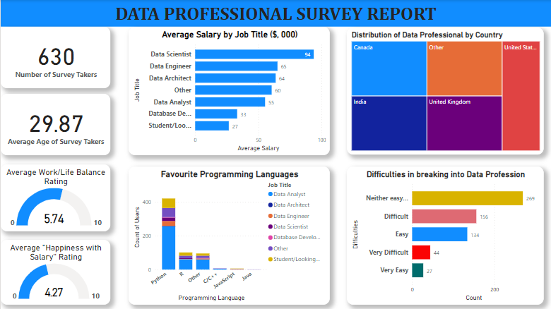

# Data Professionals Survey

## Introduction
This project is a survey on data professional across countries. 630 responses were collected, and the data cleaned and visualised on Power Bi. The information in the data includes; age, work/life balance, favorites programming languages, salary, country and more.

## Tools
Power Bi is the major tool for this project; it provides good data visualition. While Power Query(a power bi tool) is used for the data cleaning.

## Data Visualization

## Insights
- There were 630 number of survey takers. 
- The average age of the data professionals is 29.87.
- Their average work/life balance has a rating of 5.74 within the range of 1-10. Which is sligthly above average. 
- Average "Happiness with salary" rating is 4.27. This indicate that majority are quite happy with their salaries.
- This data also show that Data scientists earn the highest salaries(average of $94,000). While Data Engineers and Data Architects earn average of $65,000 and $64,000 respectively.Followed by others, Data analyst and so on.
- Python is the most favourite programming language of the professionals, followed by R. While Java is the least favorite.
- Majority of the survey takers are from Canada, India, UK and USA.
- Only a few found it "Very easy" breaking into the data profession, while majority find it either easy nor difficulty breaking through.

